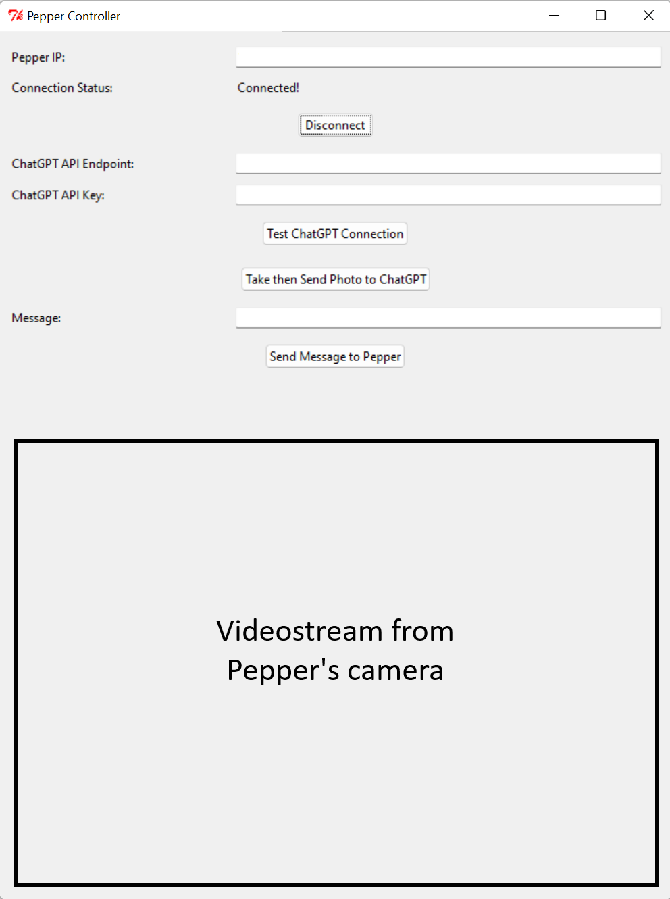

# Pepper - ChatGPT controller

## Installation
There are 2 ways of installing and using the pepper-chatgpt controller.  

If you have a windows machine, first way is to download the latest release from [Release](https://github.com/nerzid/pepper-chatgpt/releases) and run pepper_chatgpt_controller.exe. You don't need anything else.

If you don't have a windows machine, you need to run the python file yourself. Firstly, you have to install python 2.7 32-bit (not 64 bit!). if you have a python3 installed in your computer want to avoid python versions conflicting with each other, rename python.exe to python2.exe. Then, add the python folder to user environment variables.

Download pip for python 2.7 from the following link -> [Pip](https://bootstrap.pypa.io/get-pip.py) (You can copy the content of the file and create a new file with name get-pip.py then paste the content into it.) Then, navigate to the folder where the get-pip.py is located at  
`cd /path/to/folder`

while in the folder, install pip for python2 using  
`python2 get-pip.py`

Then, install Pepper SDK from the following link -> [Pepper SDK](https://community-static.aldebaran.com/resources/2.5.10/Python%20SDK/pynaoqi-python2.7-2.5.7.1-win32-vs2013.zip). As a side note, I have tried to use other versions but the only one that worked for me was python2.7-2.5.7.1 version. Otherwise, you might get import error for qi module. Unzip the SDK folder to wherever you prefered to (e.g., to desktop). Then, create an environment variable for the user as follows:  
`PYTHONPATH="path/to/pepper-sdk/lib"`  
  
in windows, it will look like this  
`PYTHONPATH="C:\Users\[user_name]\Desktop\pynaoqi-python2.7-2.5.7.1-win32-vs2013\lib"`  
(Note that PYTHONPATH is not the path of python2.7 but it is lib folder in pepper-sdk folder)

Then, install the requirements by running the following code in the terminal  
`python2 -m pip install -r requirements.txt`

## Usage

Enter Pepper's IP then press Connect button. If you are successfully connected, you will see pepper's camera view at the bottom in real time.

